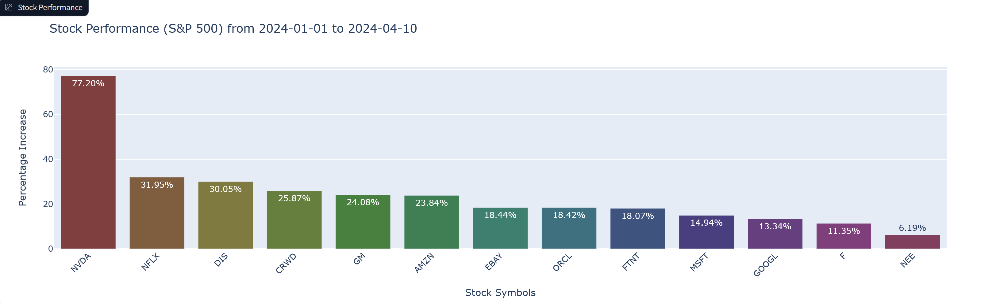
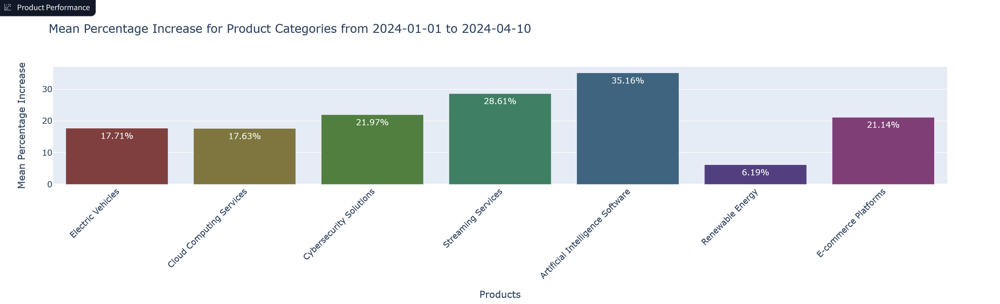
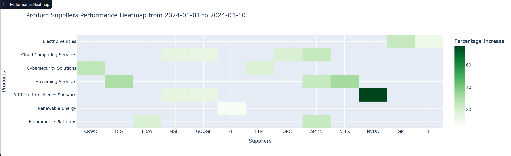

# AI Financial Market Supply-Demand Analyzer
This project is designed to identify the markets or categories of products with the most demand for a specific date, determine the main suppliers of these products in the market, and analyze their growth percentage rate.

[App](https://huggingface.co/spaces/reab5555/AI-Financial-Market-Supply-Demand-Analyzer)

## Features
- **Realtime Stock Data:** *yFinance* provides a convenient interface for fetching historical market data from Yahoo Finance. It is widely used in finance-related applications for retrieving stock prices, financial statements, company information
- **Demand Identification:** Uses large language model RAG and prompt engineering to identify the products or categories with the highest demand for a given date.   
- **Supplier Identification:** Identifies the main suppliers of the high-demand products and retrieves their stock values.   
- **Profit Analysis:** Calculates the percentage change in stock value from the demand date to a specified number of days later, indicating the profit margin of the suppliers.   

    
### Set Parameters:    
 
- *Initial Date*: Date Period: The specific date for identifying high-demand products.   
- *Number of Days*: The number of days after the demand date to analyze stock value changes.   
- *Percentage Threshold*: The minimum of percentage increase for market stocks to display for the time period.

